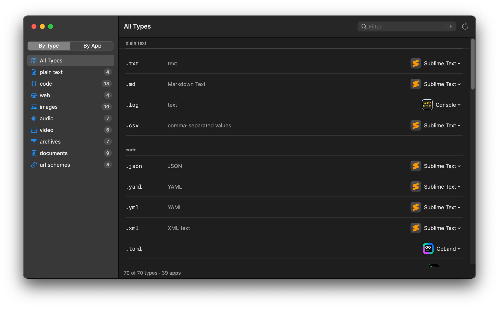

# macOSDefaultApps

View and set default application associations on macOS — file extensions, UTIs and URL schemes. A modern successor to [RCDefaultApp](https://www.rubicode.com/Software/RCDefaultApp/), [SwiftDefaultApps](https://github.com/Lord-Kamina/SwiftDefaultApps) and [duti](https://github.com/moretension/duti).

Ships as a macOS app and a CLI (`mda`).

Requires macOS 15+.

## App



- Browse types by family (text, code, images, …) or flip to a per-app view showing everything an app handles — including who currently owns each type
- Change a handler from the dropdown in each row, or pick any app via "Other…"
- Filter across extensions, UTIs and app names (⌘F)
- Covers every type and URL scheme your installed apps declare — ~1300 extensions and ~185 schemes on a typical Mac, not a fixed list
- Localized: English, Deutsch, Français, Español, Italiano, Português, Nederlands, Polski, 简体中文

## CLI

```sh
mda get md                          # default handler for .md
mda ls md                           # all candidate handlers, default marked *
mda set com.sublimetext.4 md        # set handler for an extension
mda set com.apple.Safari public.html
mda set com.apple.Mail mailto:
mda dump                            # all curated types with current handlers (or --json)
mda save                            # snapshot current handlers to ~/.mda/default
mda apply                           # restore the default preset
mda apply work                      # or a named one (~/.mda/work)
mda apply settings.duti             # or any settings file, duti-compatible
```

## Dotfiles & presets

`mda save` writes the current associations as a plain settings file to `~/.mda/` — one file per preset, human-readable, duti-syntax. Put the folder in your dotfiles (`mda save` warns when it's not under git, because unversioned saves overwrite without history). `mda apply` restores a preset: everything that can be applied is applied, apps that aren't installed are skipped and listed, and a non-zero exit tells your bootstrap script there's leftovers — re-run after installing the missing apps, it's idempotent.

The app has the same feature under **Presets** in the toolbar, with a preview of what would change before anything is written.

Targets are classified automatically: `md` / `.md` is an extension, `public.html` a UTI, `mailto:` a URL scheme.

### Migrating from duti

`mda apply` reads duti settings files as-is: three-field lines (`bundle-id  uti  role`) work unchanged — the role column is accepted and ignored, because the modern API has no role concept and always sets the all-roles default. Two bare fields mean a URL scheme, exactly like `duti -s`.

## Install

Homebrew:

```sh
brew tap klabast/tap
brew install mda                        # cli
brew install --cask macosdefaultapps    # app
```

Or grab the app from the [latest release](https://github.com/klabast/macOSDefaultApps/releases/latest), or build from source:

```sh
swift build -c release            # cli: .build/release/mda
scripts/package-app.sh            # app: build/macOSDefaultApps.app
```

The app is signed and notarized, so it opens straight away. A build you make yourself with `scripts/package-app.sh` is ad-hoc signed — macOS blocks that one on first launch: System Settings → Privacy & Security → "Open Anyway".

## Notes

- Changing the default browser (`http:`/`https:`) triggers a macOS consent dialog by design; it cannot be silenced.
- macOS has no API to *remove* an association — you can only point it at another app. Stale associations are cleaned up by LaunchServices itself.
- The extension `ts` maps to MPEG-2 Transport Stream system-wide (not TypeScript); the app shows whatever LaunchServices reports.

## License

MIT
